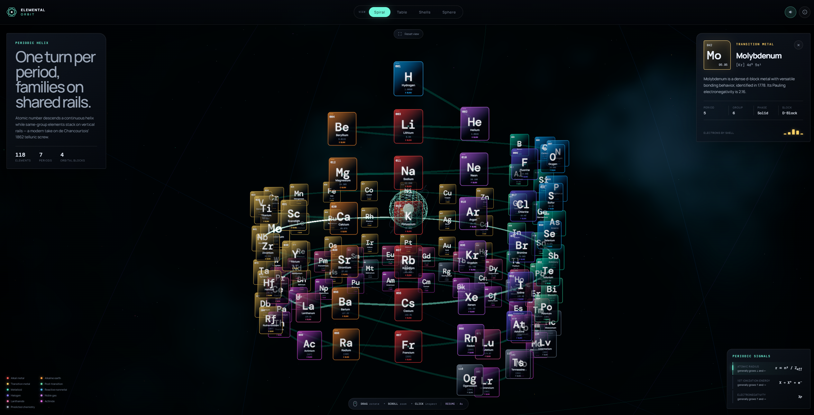
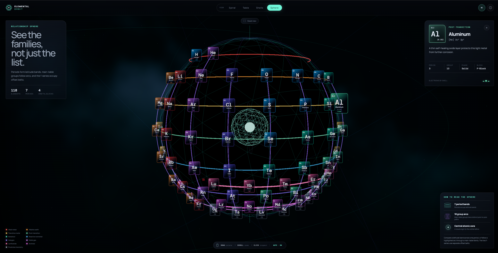
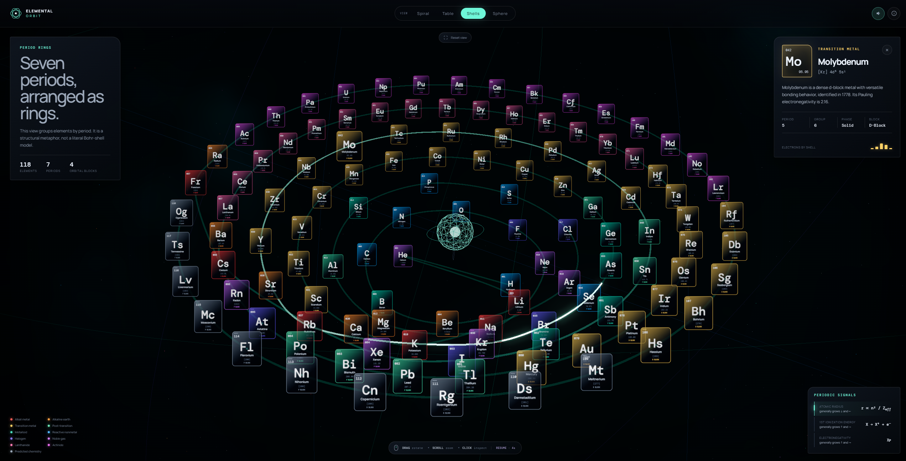
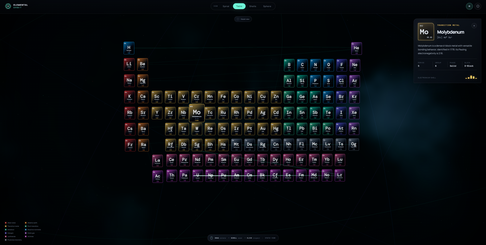

# Elemental Orbit — 3D Periodic Table

An interactive, scientifically audited periodic table that lets you explore all 118 elements as a true periodic helix, the familiar table, concentric period rings, and a relationship sphere.

[](https://github.com/krakenunbound/elemental-orbit-3d/actions/workflows/ci.yml)
[](https://github.com/krakenunbound/elemental-orbit-3d/actions/workflows/deploy-pages.yml)
[](LICENSE)

**[Launch the live visualization](https://krakenunbound.github.io/elemental-orbit-3d/)**



## Highlights

- Four coordinated views: **Spiral**, **Table**, **Shells**, and **Sphere**.
- A cylindrical periodic helix with one complete turn per period and recurring families aligned on shared rails.
- A relationship sphere with seven period bands, 18 distinct group arcs, offset f-series belts, and a visible atomic core.
- Interactive mouse/touch rotation, zooming, element inspection, category filtering, hover explanations, and scientific trend formulas.
- A procedural “Atomic Cosmos” environment with layered stars, luminous dust, orbital silhouettes, and a restrained nebula shader.
- Automatic rotation resumes five seconds after intentional interaction ends; ordinary mouse movement does not reset the timer.
- Motion reduction and lower particle counts on compact displays.
- All 118 displayed masses pinned to CIAAW 2024 abridged standard atomic weights or current IUPAC bracketed mass numbers.

## Views

| View | What it reveals |
| --- | --- |
| Spiral | Atomic number follows a continuous helix while recurring main-group families share vertical rails. |
| Table | The standard periodic grid with orbital-block depth. |
| Shells | Seven period rings presented explicitly as a structural metaphor, not a literal Bohr model. |
| Sphere | Period latitude bands, group meridians, offset f-series belts, and the shared core. |

### Complete view gallery

| Relationship sphere | Period rings |
| --- | --- |
|  |  |

| Standard table | Periodic helix |
| --- | --- |
|  |  |

## Quick start

Requirements: [Node.js](https://nodejs.org/) 22 LTS and npm.

```bash
git clone https://github.com/krakenunbound/elemental-orbit-3d.git
cd elemental-orbit-3d
npm ci
npm run dev
```

Open `http://127.0.0.1:5173/` unless Vite reports another port.

### Windows launcher

Double-click `start-server.bat`. The launcher:

- detects and replaces a previously abandoned Elemental Orbit server;
- refuses to terminate an unrelated process using its port;
- opens a supervised Vite development server on `http://127.0.0.1:4173/`;
- terminates the full server process tree when the launcher closes.

The launcher intentionally keeps its console window open: close that window or press `Ctrl+C` to stop the server cleanly.

## Controls

- **Drag:** rotate the visualization.
- **Scroll / pinch:** zoom.
- **Hover:** preview the element, category, and electron configuration.
- **Click:** open the detailed element panel.
- **View selector:** morph between all four coordinate systems.
- **Legend:** isolate an element category.
- **Reset view:** restore the active layout’s camera.

## Commands

| Command | Purpose |
| --- | --- |
| `npm run dev` | Start the Vite development server. |
| `npm test` | Run scientific, geometric, and interface regression tests. |
| `npm run build` | Create a production build in `dist/`. |
| `npm run preview` | Preview the production build. |
| `npm run check` | Run the complete test and build quality gate. |

For a subpath deployment, set `BASE_PATH` before building:

```bash
BASE_PATH=/your-subpath/ npm run build
```

PowerShell:

```powershell
$env:BASE_PATH = "/your-subpath/"
npm run build
```

## Scientific conventions

- Standard atomic weights use the **CIAAW 2024 abridged table**, including the revised zirconium value.
- Elements without standard atomic weights use bracketed longest-lived-nuclide mass numbers from the current IUPAC periodic table.
- The visualization follows the traditional **La/Ac group-3 convention**; Lu and Lr remain in the f-series.
- Group 12 is categorized as transition metal, a disclosed and defensible boundary convention.
- Spatial arrangements are relationship visualizations. The Shells view is not a literal atomic orbital or Bohr-shell model.

The project’s review trail is preserved in [SCIENTIFIC_AUDIT.md](SCIENTIFIC_AUDIT.md), [SCIENTIFIC_REVIEW.md](SCIENTIFIC_REVIEW.md), and [SCIENTIFIC_REAUDIT.md](SCIENTIFIC_REAUDIT.md). See [CHANGELOG.md](CHANGELOG.md) for the implementation history.

## Architecture

```text
src/main.js           Three.js scene, interaction, layouts, shaders, and UI behavior
src/elements.js       Normalized element metadata and scientific presentation
src/atomic-masses.js  Pinned 118-element mass reference table
src/layouts.js        Testable helix and relationship-sphere coordinate math
src/style.css         Responsive glass interface and accessibility styling
test/                 Node-based scientific, geometry, and interface regression tests
scripts/              Safe Windows development-server launcher
```

No server-side services, tracking scripts, accounts, or API keys are required.

## Contributing

Please read [CONTRIBUTING.md](CONTRIBUTING.md) before submitting changes. Scientific corrections should include a primary source and regression coverage whenever the claim can be encoded as a test.

## License

Released under the [MIT License](LICENSE).
